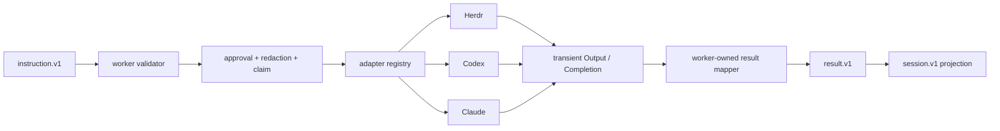

# Herdr, Codex, and Claude adapter boundary

## Purpose lineage

| generation | purpose | contribution | relation |
|---:|---|---|---|
| G0 scope | Implement H, I, and J lanes. | Adds typed payloads and concrete Herdr, Codex, and Claude adapters. | direct |
| G1 correctness | Reject hidden flags, malformed provider output, session drift, and path escape. | Exact payload validation and parser fixtures fail closed. | direct |
| G2 boundary | Keep `hq` and worker core provider-neutral. | Concrete commands live only in `internal/worker/agentadapter`. | direct |
| G3 evidence | Preserve one durable result vocabulary. | Adapters return transient output/completion only; the worker mapper owns `result.v1`. | direct |
| G4 product | Add or replace providers without changing compiler meaning. | One registry factory supplies three exact canonical targets. | direct |
| G5 operations | Recover answers without terminal scrollback. | Codex final files, Claude JSON/logs, and Herdr reads become mapper-ready output. | direct |
| G6 organization | Run parallel agents through one reviewable port. | Native ids are hints; canonical run identity stays worker-owned. | direct |
| G7 business | Reduce per-agent integration and supervision cost. | Shared runner, strict decoder, output mapper boundary, and fixtures are reused. | indirect |
| G8 transfer | Remove operator-only CLI knowledge. | Exact command mappings and destructive cases are checked in. | indirect |
| G9 due diligence | Make adapter claims reproducible without credentials. | Fake runner and official-shape fixtures run on Linux and Windows CI. | indirect |
| G10 meta | Increase company value and saleability. | Replaceable, observable agent lanes lower hidden coupling and handoff risk. | indirect |

## Package flow

## Ownership

| owner | owns | must not own |
|---|---|---|
| instruction contract | target action and typed payload | provider side effects |
| agent adapter | exact argv, provider parsing, transient output, native hint | event id, sequence, timestamp, result kind, durable append |
| worker | policy order, claim, dispatch, result mapping, redaction, append | provider CLI flags |
| observation | rebuildable list/show/tail | execution or retry authority |

## Provider mappings

| target | action | provider command/effect | durable claim |
|---|---|---|---|
| Herdr | `start` | `herdr agent start ... -- <argv...> <prompt>` | agent name is a native hint |
| Herdr | `read` | `herdr agent read` | output is transient until mapped |
| Herdr | `observe` | `herdr agent wait`, then read | no TUI polling required |
| Herdr | `attach` | return typed `herdr agent attach` target | adapter does not enter TUI |
| Codex | `exec` | `codex exec --json --output-last-message` | thread id + final text/path |
| Codex | `resume` | `codex exec ... resume <id>` | session drift fails closed |
| Claude | `print`/`resume` | `claude -p --output-format json|stream-json` | result + session hint |
| Claude | `background` | `claude --bg --session-id <run-bound UUID>` | known native hint before invocation |
| Claude | `logs` | `claude logs <id>` | recovered text |
| Claude | `attach` | return typed `claude attach` target | adapter does not enter TUI |

## Destructive cases

The adapter lane fails review when any of these is possible:

1. raw shell text replaces typed Herdr argv;
2. target aliases or unknown targets fall back;
3. adapter output carries durable event identity or lifecycle status;
4. Codex final answer exists only on stdout;
5. malformed Codex JSONL silently succeeds;
6. resumed Codex thread id changes without failure;
7. Codex output path escapes the request cwd;
8. Claude JSON/stream-json has no final result but completes green;
9. resumed Claude session id drifts;
10. Claude background mode uses `-p` despite the provider contract;
11. Herdr/Claude attach starts an interactive process inside the worker;
12. provider stderr bypasses the common transient output port;
13. fixture success is described as live-provider proof;
14. adapter registration silently supplies the `sh` target;
15. provider-specific status creates a second durable vocabulary;
16. retry or ambiguous crash recovery is authorized by an adapter.

## Evidence boundary

The checked-in fake-runner tests prove payload-to-command mapping and parser behavior without credentials. They are Q2 adapter evidence. Live/provider-installed whole-path proof remains owned by L and managed crash/recovery behavior remains owned by #98. No fixture is evidence that an external provider performed a real effect.
