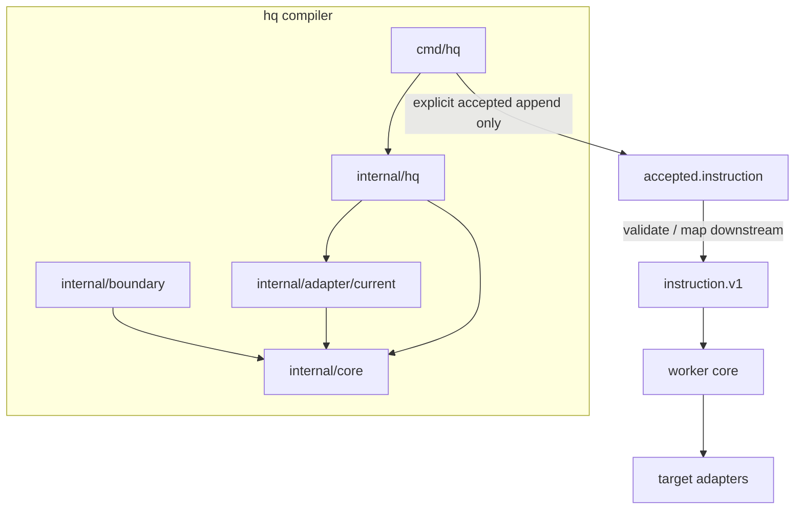
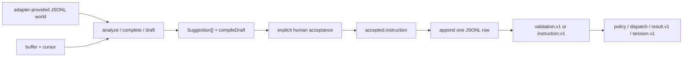

# Core, port, and adapter boundary

Refs #16, #32, #33, #34, and #35.

## Purpose

`hq` is a JSONL-aware autocomplete compiler and acceptance surface. It owns schema-independent compilation mechanics, not business meaning and not execution.

```text
JsonlWorld + CursorContext
  -> Suggestion[] with compileDraft
  -> human Acceptance
  -> accepted.instruction compiler envelope
  -> downstream validation / instruction.v1
  -> worker outside hq
```

The readback sentence is:

> `hq is meaning-free; JSONL carries meaning; a downstream worker executes.`

## Package responsibility map

| Package or path | Responsibility | May know concrete schema vocabulary? | May execute processes? |
|---|---|---:|---:|
| `internal/core` | Canonical protocol types and schema-independent compilation mechanics | No | No |
| `internal/boundary` | Abstract read/write ports | No | No |
| `internal/adapter/current` | Current proof-era schema JSONL parser and adapter-owned translation | Yes | No |
| `internal/hq` | Compatibility surface over core types and adapter-owned world data | Only through delegated adapter data | No |
| `cmd/hq` | CLI, interactive completion, human acceptance, explicit append-only queue write | No target-specific behavior | No |
| worker contract/core packages | Validation, policy, canonical result events, session projection, and dispatch preparation | Yes | No direct target effect |
| downstream target adapters | Target-specific execution effects after worker validation/policy | Yes | Yes, within their own guarded boundary |
| `tests`, `spec/fixtures`, `docs/evidence` | Contract and review evidence | Yes | Tests may use inert fixtures only |

## Dependency direction



No edge returns from worker or adapters into compiler packages.

## Data flow



`complete`, `context`, and `draft` stop before acceptance and therefore cannot write the queue. `accept` may write only when an explicit queue path is supplied. Neither path may start a target process.

The compiler envelope is not itself runtime authority. Worker validation decides whether downstream input becomes canonical `instruction.v1`; invalid input becomes `validation.v1` and never creates a run/session.

## Meaning ownership

| Kind of meaning | Owner |
|---|---|
| Cursor position, token boundaries, edit ranges, ranking, draft construction | `internal/core` compilation mechanics |
| Concrete completion operations, targets, payload fields, and examples | JSONL schema adapters and fixture data |
| Canonical worker instruction/result/session/status vocabulary | Versioned worker contracts under `spec/` |
| Whether an instruction is safe or executable | downstream worker policy |
| How Herdr, shell, Codex, Claude, or another target is invoked | downstream target adapter |
| Run status, output, session id, retry, attach, and observation | downstream worker/event ledger |

Core may preserve opaque values but must not interpret or invent named execution targets or default operations.

## Mechanical gates

| Gate | Protected failure |
|---|---|
| Core vocabulary and behavior tests | Concrete operation/target words or fallback values become compiler semantics. |
| Compiler execution boundary test | Process launch, raw syscall/cgo/plugin/linkname escape, PTY dependency, or named adapter enters `internal/core`, `internal/hq`, or `cmd/hq`. |
| Protocol contract tests | Worker instruction/validation/result/session/status contracts drift or accept invalid data. |
| Negative guard fixtures | A boundary test exists but cannot detect forbidden code. |
| Functional accept proof | Preview appends rows, acceptance appends more than one row, or a target executable is launched. |
| Vim contract proof | Editor integration adds an implicit queue, duplicate compiler, or execution path. |

## Explicit non-goals

- Target adapter implementation.
- Execution inside `hq`.
- ADRS raw authority or accepted-ledger authority.
- Remote API or database runtime.
