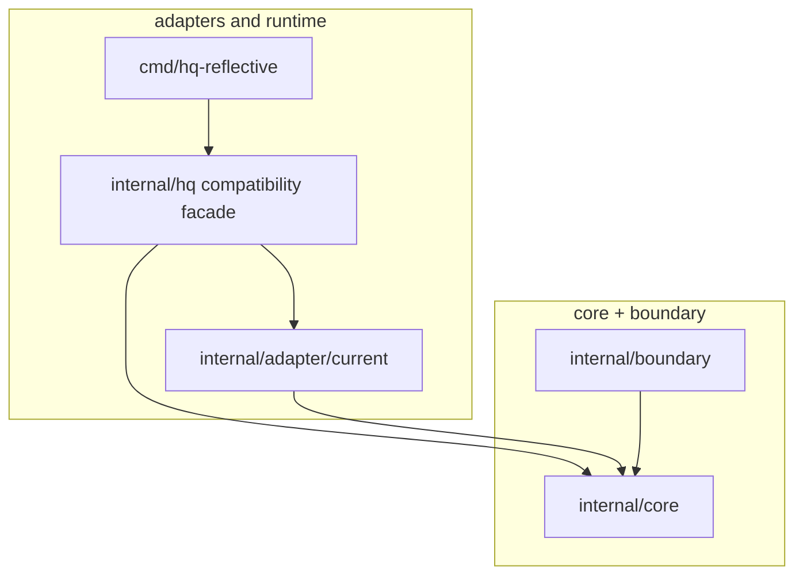
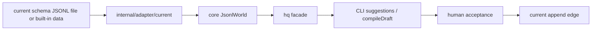

# Core, port, and adapter boundary

Refs #16.

## Purpose

`hq` must stay a JSONL autocomplete compiler, not an ADRS-specific schema runtime.

The core library owns meaning:

```text
JsonlWorld + CursorContext -> Suggestion[] -> Acceptance -> Instruction
```

Concrete file shapes belong at the edge.

## Package responsibility map

| Package or path | Responsibility | May know concrete file schema? |
|---|---|---:|
| `internal/core` | Canonical protocol data types and cursor/world meaning model | No |
| `internal/boundary` | Abstract read/write boundary interfaces | No |
| `internal/adapter/current` | Current proof-era schema JSONL parser and adapter-owned file translation | Yes |
| `internal/hq` | Backward-compatible facade while the old CLI is migrated | Yes, only by delegating to adapters |
| `cmd/hq-reflective` | Current terminal runtime/proof command | Yes, through `internal/hq` facade |
| `tests`, `examples`, `docs/proofs` | Proof, fixtures, and review evidence | Yes |

## Dependency direction



## Data flow



## Non-negotiable rule

`internal/core` must not import ADRS projected schemas, hq queue envelope schemas, UI projection schemas, or target payload schemas.

`source_ref` is opaque to core. Any future interpretation belongs to adapters.

## Phase gate

Phase 2 projected and queue adapters may start only after these are true:

| Gate | Required state |
|---|---|
| Core package exists | `internal/core` is present |
| Boundary package exists | `internal/boundary` is present |
| Current adapter exists | `internal/adapter/current` is present |
| Concrete schema parser outside core | current JSONL parser lives in adapter |
| Existing behavior preserved | old `internal/hq` tests and CLI proof keep passing |

## Explicit non-goals

| Non-goal | Reason |
|---|---|
| ADRS raw parser | ADRS raw authority belongs outside hq |
| ADRS projected adapter | Phase 2 only |
| hq queue envelope runtime writer | Phase 2 only |
| Remote API or DB | File-only path first |
| Agent execution | hq creates accepted instructions; execution is outside |
