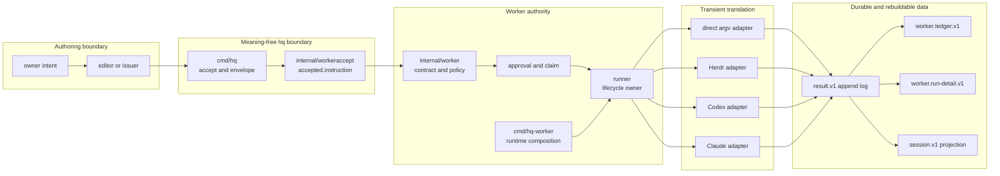
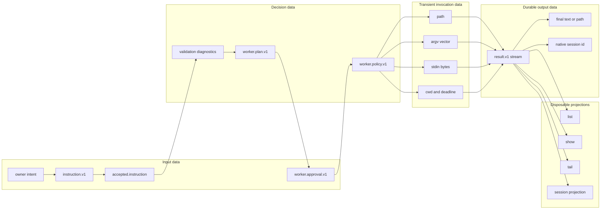

# hq JSONL worker boundary — specification review closeout

## One-line readback

**`hq` has no provider execution meaning; canonical JSONL carries meaning; the worker validates and owns lifecycle; adapters translate one approved row into one transient provider invocation; append-only `result.v1` rows remain the durable execution evidence from which every list, show, tail, and session view is rebuilt.**

This sentence is the review boundary. A change that makes `hq` interpret Herdr, Codex, Claude, or shell syntax violates it.

## Purpose lineage

| generation | purpose | lane-L contribution | relation |
|---:|---|---|---|
| G0 scope | Close `#79-#84` with executable evidence. | Adds merge-gated contract, dry-run, E2E, provider, and readback proof. | direct |
| G1 correctness | Prevent contract drift and empty-registry false green. | Valid/invalid fixtures and all four runtime registrations execute in CI. | direct |
| G2 safety | Preview before side effects and prevent command-string injection. | Dry-run executes zero providers; `target=sh` is direct argv only. | direct |
| G3 interruption | Stop bounded work without inventing state. | Real subprocess timeout/cancel maps to canonical terminal evidence. | direct |
| G4 provider fidelity | Preserve exact noninteractive interfaces. | Codex and Claude prompts use stdin; Herdr returns observed IDs and read-only follow frames. | direct |
| G5 evidence | Reconstruct every outcome outside terminal scrollback. | `result.v1`, ledger, show, tail, final files, and session projection are retained. | direct |
| G6 portability | Keep one meaning across operating systems. | The same proof generator runs on Linux and Windows. | direct |
| G7 organization | Replace providers without changing lifecycle authority. | Provider details stay in adapters; worker remains the single lifecycle owner. | indirect |
| G8 transfer | Remove dependence on the original operator's memory. | One command regenerates the complete evidence bundle. | indirect |
| G9 diligence | Let a reviewer disprove runtime claims quickly. | Claims, non-claims, source rows, process invocations, and readback are indexed together. | indirect |
| G10 meta | Increase company value and saleability. | Low coupling, deterministic proof, and clear authority reduce handoff and buyer risk. | indirect |

## Package architecture



The dependency direction is deliberate:

- `internal/worker` imports the adapter contract, not provider implementations.
- provider adapters return transient output/completion/error values; they cannot choose durable event identity, sequence, time, or status;
- `cmd/hq-worker` is the executable composition root that installs concrete adapters;
- `cmd/hq` does not import provider adapters and does not execute them.

## Data flow



## Ownership table

| surface | owns | must not own |
|---|---|---|
| owner / issuer | intent and final approval | provider lifecycle internals |
| `cmd/hq` | accepting a canonical instruction and writing the accepted envelope | shell syntax, provider argv, execution, result status |
| `instruction.v1` | target, operation, payload, source identity | execution result |
| worker contract / policy | validation, cwd bound, approval digest, timeout, single-writer claim | provider protocol parsing |
| runtime registry | explicit product composition of canonical targets | durable run state |
| target adapter | exact provider path, argv, stdin, parser, transient native ID | event ID, sequence, timestamp, terminal status authority |
| provider process | external work | canonical worker evidence |
| `result.v1` log | durable accepted/started/stream/terminal evidence | mutable projection state |
| list / show / tail / session | rebuildable read views | authority or side effects |

## Exact execution contracts

### `target=sh`

The historical target name does not imply a shell process. The adapter executes:

```text
path = payload.argv[0]
args = payload.argv[1:]
```

There is no command string, shell expansion, glob expansion, pipe parsing, redirection parsing, variable interpolation, or metacharacter interpretation. CI passes a value containing `;`, `&&`, and `$()` as one literal argv element and proves that the named side-effect file is not created.

### Codex

Fresh and resumed prompts use stdin, not a prompt argv element:

```text
codex exec --json --color never --output-last-message <path> ... -
codex exec --json --color never --output-last-message <path> ... resume <observed-thread-id> -
```

The adapter parses JSONL, persists the observed thread ID, and requires a non-empty final file.

### Claude

Print and resume prompts use stdin:

```text
claude -p --output-format json ...
claude -p --output-format stream-json --verbose --resume <observed-session-id> ...
```

The adapter persists stream rows, verifies session continuity, and requires a final result.

### Herdr

Start parses the returned `terminal_id`, with `pane_id` only as a fallback. Read and observe use that durable reference. Worker-side attach is a bounded, read-only follow through `terminal session observe`; it does not take control of an interactive terminal.

## Proof index

| issue | claim | executable evidence | retained artifact |
|---:|---|---|---|
| #79 | contract fixtures are merge-gated, including negative cases | `tests/test_protocol_contract.py` under `scripts/check_worker_lane_l.py` | `contract-fixture-test.*.log`, `contract-fixture-matrix.json` |
| #80 | canonical rows produce externally reviewable plans with zero execution | real `hq-worker --dry-run` over accepted and invalid rows | `source-instructions.jsonl`, `accepted-instructions.jsonl`, `dry-run-plan.jsonl`, `dry-run-invalid-plan.jsonl`, `readback.json` |
| #81 | `hq accept -> worker -> direct argv -> result/readback` completes once | real `hq` and `hq-worker` binaries, exact approval, direct process, duplicate reread | `approvals.jsonl`, `events.jsonl`, `ledger.jsonl`, `show-readback.jsonl`, `tail-readback.jsonl`, `session-projection.jsonl`, `duplicate-read-output.jsonl` |
| #82 | Herdr adapter crosses the worker boundary and persists session reference | installed deterministic Herdr-shaped executable through the real OS runner | `provider-invocations.jsonl`, Herdr rows in event/ledger/show artifacts |
| #83 | noninteractive agent execution persists final and session evidence | installed deterministic Codex- and Claude-shaped executables through the real OS runner | exact argv/stdin digest/base64, final files, event/ledger/show artifacts |
| #84 | a new reviewer can locate architecture, authority, proof, and limits | this document and the workflow artifact | `docs/architecture/spec-review-closeout.md` |

CI entrypoint: `.github/workflows/worker-lane-l-proof.yml`  
Local regeneration entrypoint: `python scripts/check_worker_lane_l.py`

## Fixture proof versus live service proof

The normal merge gate intentionally avoids network credentials and external service availability. Its Herdr, Codex, and Claude executables are deterministic provider-shaped fixtures with these properties:

- they are real built executables;
- the worker starts them through the production `exec.CommandContext` path;
- path, argv, cwd, stdin bytes, exit status, stdout/stderr, native IDs, final files, events, and readback use production code;
- every invocation artifact sets `fixture_only=true`;
- `readback.json` sets `external_service_access_claimed=false`.

Therefore this proof supports adapter integration and durable non-TUI execution claims. It does **not** claim that a third-party account, network, billing path, model response, or live Herdr server was available in that CI run. A live smoke test may be added as a separate non-authoritative compatibility signal; it must not replace this deterministic merge gate.

The invocation artifact includes fixture stdin as base64 so reviewers can verify exact transport. Production prompts must not be copied into this proof artifact path.

## Regeneration and review

Run:

```text
python scripts/check_worker_lane_l.py
```

A successful bundle contains `result.txt` plus:

1. contract test logs and fixture hashes;
2. source and accepted instructions;
3. accepted and blocked dry-run plans;
4. exact digest-bound approvals;
5. provider invocation rows;
6. append-only worker events;
7. ledger, show, tail, and session readback;
8. duplicate reread evidence proving zero second provider execution;
9. versions and explicit fixture limitations.

Review fails if any of the following is true:

- an invalid fixture passes;
- dry-run creates an event, provider invocation, or side effect;
- a canonical target is absent from the executable registry;
- `target=sh` reparses metacharacters;
- timeout or cancellation fails to terminate the real subprocess;
- prompt text appears as the Codex or Claude prompt argv element;
- an observed native session ID changes during resume;
- a run lacks a terminal `result.v1` row or durable final result;
- list/show/tail cannot rebuild from the accepted stream and event log;
- rereading the same instruction executes a provider again;
- fixture evidence is presented as live external-service evidence.

## Final boundary checklist

- [x] `hq` is not the executor.
- [x] JSONL is the only cross-boundary meaning carrier.
- [x] dry-run is side-effect free.
- [x] approval is bound to the canonical instruction digest.
- [x] one executable composes all canonical adapters.
- [x] direct argv has no shell reparse.
- [x] provider prompts have explicit stdin transport.
- [x] provider/native session identity is durable evidence.
- [x] result rows, not terminal scrollback, own execution readback.
- [x] projections are rebuildable and read-only.
- [x] fixture limitations are explicit and machine-readable.
- [x] Linux and Windows run the same proof generator.
