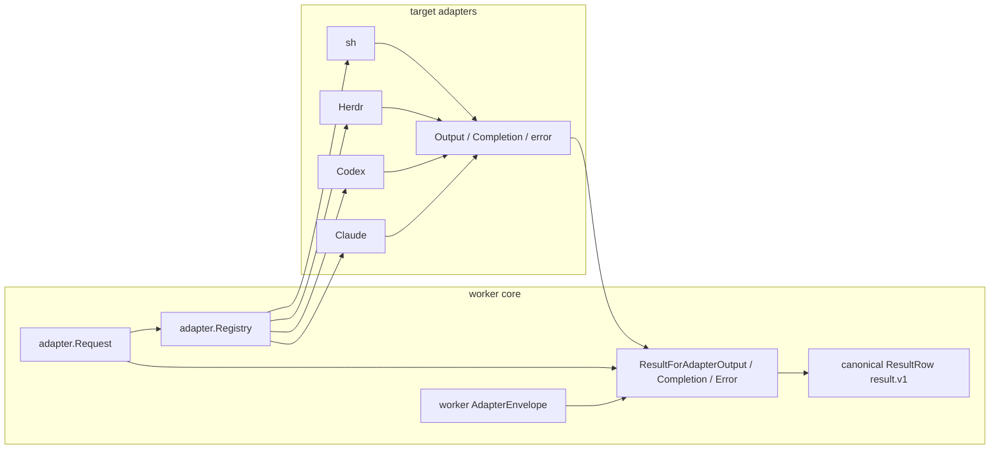

# Worker adapter contract

Issues: #49, #50, #51

## Purpose lineage

| generation | purpose | contribution |
|---|---|---|
| G0 scope | Define a replaceable adapter interface, explicit registry, and canonical output mapping. | Direct |
| G1 runtime | Keep shell, Herdr, Codex, and Claude CLI details outside worker core. | Direct |
| G2 evidence integrity | Keep run identity, sequence, time, lifecycle kind, and status worker-owned. | Direct |
| G3 product | Add targets without rewiring core validation, ledger, or observation. | Direct |
| G4 operations | Fail closed on unknown/unavailable targets and expose registry state in dry-run. | Direct |
| G5 factory | Let target adapters be implemented independently against one transient boundary. | Direct |
| G6 quality | Turn target drift, identity forgery, and second event protocols into test failures. | Direct |
| G7 transfer | Remove tribal knowledge from dispatch and result mapping. | Indirect |
| G8 due diligence | Make runtime boundaries and failure behavior reviewable from code and fixtures. | Indirect |
| G9 asset value | Create a reusable low-cost target execution edge. | Indirect |
| G10 meta | Reduce operating, handoff, and buyer integration risk. | Indirect |

## One durable contract

The worker contract SSOT remains:

- `instruction.v1` for validated input;
- `validation.v1` for rejected input before a run exists;
- `result.v1` for every durable run event/output/error;
- `session.v1` for rebuildable projection.

The adapter layer defines no persisted event schema. Adapter values are transient and become durable only after the worker maps them into its existing `ResultRow` implementation of `result.v1`.

## Boundary

## Adapter-owned transient data

| type | allowed fields | forbidden ownership |
|---|---|---|
| `Request` | validated run/instruction/target/op/payload/cwd input | validation authority or persistence |
| `Output` | stdout/stderr kind, message, optional native session id | event id, seq, time, status, result kind |
| `Completion` | final text/path, optional native session id | completed status or durable final row |
| error | ordinary error or typed failed/blocked detail | timeout/cancel lifecycle identity, event metadata |

A completion with neither text nor path is rejected. Missing final output cannot silently become a successful `completed` row.

## Worker-owned mapping

`AdapterEnvelope` supplies `event_id`, `seq`, and `recorded_at`. The validated request supplies `run_id`, `instruction_id`, and `target`. The worker mapper supplies canonical `result.v1` kind and fields:

| transient source | canonical result kind |
|---|---|
| stdout output | `stdout` with `message` |
| stderr output | `stderr` with `message` |
| valid completion | `completed` with `final{text?,path?}` |
| deadline | `timeout` with typed error |
| cancellation | `cancelled` with typed error |
| unavailable canonical adapter | `blocked(adapter_unavailable)` |
| typed policy/adapter rejection | `blocked` or `failed` |
| ordinary error | `failed(adapter_error)` |
| malformed typed failure | `failed(protocol_error)` |

No adapter can set identity, ordering, time, status, or final lifecycle kind because those fields do not exist in adapter-owned types.

## Registry rules

- Registration is explicit and immutable after construction.
- Resolution is exact and case-sensitive.
- There is no default adapter and no alias expansion.
- Unknown instruction targets are rejected by worker validation as `validation.v1`.
- A canonical target with no registered adapter returns `AdapterUnavailableError` and maps to `result.v1 blocked`.
- Duplicate and nil registrations fail.
- `Registry.Snapshot` returns a sorted list without executing adapters.

## Proof

- Adapter tests prove replaceability, exact canonical target resolution, alias/duplicate/unavailable rejection, and zero execution during lookup.
- Transient-type tests prove adapters cannot carry durable envelope fields.
- Worker mapper tests compare generated rows against four target rows copied exactly from the canonical `spec/fixtures/result.runs.jsonl` family.
- Completion tests prove canonical `final{text,path}` mapping and rejection of empty completion.
- Error tests prove timeout, cancellation, unavailable, blocked, generic failure, and malformed structured failure map to canonical terminal kinds.
- A static test rejects any reintroduction of the retired parallel adapter event version in implementation, docs, or fixture files.

## Non-goals

This change does not implement concrete target adapters, plugin discovery, UI rendering, accepted-ledger admission, or remote authority. It defines only the replaceable transient port, fail-closed registry, and worker-owned canonical result mapping.
