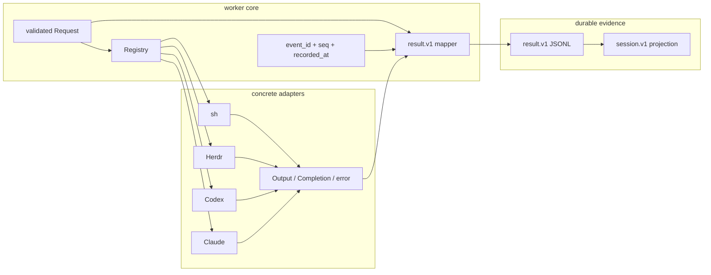

# Worker adapter contract

Issues: #49, #50, #51

## Purpose lineage

| generation | purpose | contribution |
|---|---|---|
| G0 scope | Define one replaceable worker-to-adapter port, one explicit registry, and one canonical output mapping. | Direct |
| G1 runtime | Keep shell, Herdr, Codex, and Claude process details outside worker core. | Direct |
| G2 evidence integrity | Prevent adapters from choosing event identity, order, time, or lifecycle meaning. | Direct |
| G3 contract | Make merged `result.v1` the only durable run-output vocabulary. | Direct |
| G4 product | Add or replace concrete adapters without changing worker evidence consumers. | Direct |
| G5 operations | Fail closed for invalid targets and missing canonical adapters. | Direct |
| G6 factory | Let adapter implementations progress independently against one small port. | Direct |
| G7 quality | Turn schema drift, hidden aliases, and false completion into test failures. | Indirect |
| G8 transfer | Make dispatch and evidence ownership understandable without chat or operator memory. | Indirect |
| G9 due diligence | Give reviewers executable proof of the boundary and its destructive cases. | Indirect |
| G10 meta | Reduce integration, handoff, and technical-DD risk in a saleable company. | Indirect |

## Boundary

## Authority split

| owner | owns | does not own |
|---|---|---|
| adapter | target CLI/process/session details, streaming `Output`, terminal `Completion`, typed failure | durable event identity, sequence, time, result kind, status projection, persistence |
| worker | validated request, registry selection, event envelope, mapping, append order | target command syntax or parser details |
| `spec/result/v1.md` | durable result fields, kinds, final/error shapes, allowed targets | concrete execution implementation |
| `session.v1` | rebuildable projection only | evidence authority |

There is no adapter-specific durable event row. `internal/worker/resultv1` is only the Go binding derived from the merged `spec/result/v1.md` contract and its canonical fixture.

## Transient adapter port

`Adapter.Run(context, Request, Emit) (Completion, error)` is the replaceable port.

- `Request` carries validated run/instruction identity, canonical target, operation, payload, and optional working directory.
- `Output` carries only `stdout` or `stderr`, its message, and an optional native session id.
- `Completion` carries final text and/or final path plus an optional native session id.
- A completion with neither text nor path is invalid. It cannot create a false `completed` row.
- Adapters cannot provide `event_id`, `seq`, `recorded_at`, or a durable result kind.

## Registry rules

- Registration is explicit and immutable after construction.
- Only the four `instruction.v1` / `result.v1` targets are accepted: `sh`, `herdr`, `codex`, and `claude`.
- Resolution is exact and case-sensitive.
- There is no default adapter and no alias expansion.
- A non-canonical target remains input-validation evidence; it does not become a fabricated run.
- A canonical target with no registered adapter returns `AdapterUnavailableError` and may map to canonical `blocked(adapter_unavailable)` evidence.
- `Registry.Snapshot` returns the sorted registered target list without executing an adapter.

## Canonical mapping

| transient outcome | durable `result.v1` kind | durable detail |
|---|---|---|
| stdout output | `stdout` | `message` |
| stderr output | `stderr` | `message` |
| valid completion | `completed` | `final.text` and/or `final.path` |
| typed execution failure | `failed` | `error` |
| policy or missing-adapter block | `blocked` | `error` |
| deadline | `timeout` | `error` |
| cancellation | `cancelled` | `error` |

The worker supplies `event_id`, `seq`, and UTC `recorded_at`. Request identity supplies `run_id`, `instruction_id`, and `target`. The adapter cannot overwrite either set.

`accepted` and `started` are worker lifecycle events and are not adapter outputs.

## Error behavior

- Context deadline maps to canonical `timeout` with `deadline_exceeded`.
- Context cancellation maps to canonical `cancelled`.
- Missing canonical adapter maps to `blocked(adapter_unavailable)`.
- Policy rejection maps to `blocked(policy_blocked)`.
- A valid typed adapter failure preserves its canonical terminal kind and error detail.
- A malformed typed failure maps to `failed(protocol_error)`.
- An unknown target cannot be written as `result.v1`; upstream validation owns that rejection.

## Mechanical proof

`contract_test.go` proves:

1. all four canonical targets resolve only when explicitly registered;
2. aliases, case changes, duplicate targets, nil adapters, and unknown targets fail closed;
3. registry inspection never runs an adapter;
4. adapter data cannot carry durable envelope fields;
5. missing final output cannot become a completed run;
6. no parallel persisted adapter-event type remains in code or documentation;
7. sh, Herdr, Codex, and Claude mappings are structurally equal to selected rows loaded directly from `spec/fixtures/result.runs.jsonl`;
8. timeout and cancellation remain distinct canonical result kinds;
9. malformed typed failures become explicit protocol failures.

The full repository gate remains `bash scripts/check.sh`, which executes `go test ./...` and the Linux/Windows official hq proofs.

## Non-goals

This change does not implement concrete target adapters, plugin discovery, UI rendering, accepted-ledger admission, or remote authority. It defines only the transient port, fail-closed registry, canonical mapper, and executable boundary proof.
