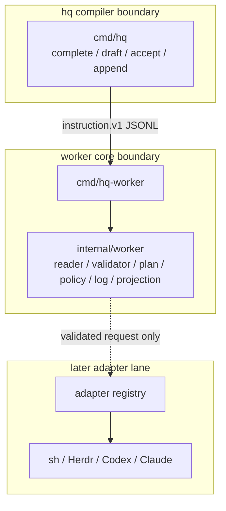
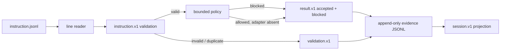

# Worker core boundary

## Purpose lineage

| generation | purpose | contribution |
|---:|---|---|
| G0 scope | Close hq #41-#48 without starting concrete adapters. | Separate worker command, line reader, validator, dry-run, bounded policy, evidence log, idempotency, and projection. |
| G1 correctness | Never dispatch malformed, unknown, duplicated, or policy-blocked input. | Every input line is read independently and fails closed before adapter selection. |
| G2 contract | Consume `instruction.v1`, `validation.v1`, `result.v1`, `session.v1`, and the shared status taxonomy exactly. | Go tests execute the canonical fixtures rather than copying private schemas. |
| G3 boundary | Keep `hq` a meaning-free compiler. | `cmd/hq-worker` is a separate executable and `internal/worker` imports no compiler or command package. |
| G4 evidence | Preserve rejected input without fabricating a run. | Canonical `validation.v1` records source line and typed error; immutable input and dry-run plans retain source path and raw row context. |
| G5 recovery | Rebuild run state after restart. | `result.v1` is append-only; `session.v1` is a deterministic projection with sequence and transition checks. |
| G6 safety | Bound future dispatch before side effects. | Target/op hooks, lexical workspace bounds, timeout defaults/maxima, and environment allowlisting run before dispatch. |
| G7 operations | Remove TUI and terminal-memory dependence. | Dry-run plans and durable evidence are JSONL; failures are typed. |
| G8 factory scale | Add adapters without changing reader, policy, ledger, or projection. | The worker core is target-neutral and concrete adapters remain a later lane. |
| G9 due diligence | Let a third party reproduce the boundary and negative cases. | Linux/Windows builds, race/vet/tests, CLI artifacts, and fixture readback are CI-gated. |
| G10 meta | Increase the value and saleability of the operating company. | Small replaceable parts, durable evidence, and low key-person risk reduce transfer cost. |

## Package architecture

`internal/worker` imports neither `internal/hq` nor `cmd/hq`. The current core has no registry and starts no process. Normal mode therefore writes a valid `accepted -> blocked(adapter_unavailable)` result run after validation and policy, which is safer than a hidden fallback.

## Data flow

The log carries only canonical durable row types:

- `validation.v1` for input that cannot honestly become a run, including malformed rows and duplicate queue readback;
- `result.v1` for valid run evidence.

`session.v1` is rebuilt from `result.v1`; it is never a second authority. No private rejection or adapter-event schema is persisted.

## Deterministic read and validation

- Empty lines are ignored.
- Comments are unsupported and reported as malformed JSON.
- A malformed line never hides later lines.
- The immutable instruction stream and `worker.plan.v1` preserve path, line, and raw row context.
- Durable `validation.v1` identifies the rejected one-based source line without inventing run or event ids.
- Unknown top-level fields fail closed.
- `instruction.v1` requires `op=run`, canonical target payloads, UTC timestamps, and an empty reserved policy object.
- Duplicate ids inside one read are rejected before policy.

## Bounded policy

Policy executes only after contract validation and before any future adapter call:

- explicit target allow/deny hooks;
- explicit operation deny hook;
- cleaned `cwd` must remain lexically under the configured workspace;
- positive default timeout and optional maximum;
- environment keys must be explicitly allowlisted; values are not echoed into plans.

This is not a full OS sandbox. Symlink-race protection, secret scanning, approval workflow, and concrete process isolation remain separate issues and are not falsely claimed here.

## Durable state and idempotency

- Every evidence row is appended and fsynced.
- Duplicate `result.v1.event_id` values fail readback.
- `seq` is contiguous from zero and authoritative inside a run.
- Result identity and native session id cannot drift.
- Terminal statuses have no outgoing transition.
- A queued run can resume after a crash without appending a second accepted event.
- A running or terminal run is never re-executed in normal mode; a canonical `validation.v1` duplicate rejection is appended.
- `--replay` creates a new run id and leaves prior evidence unchanged.

## Destructive cases guarded

1. Worker logic placed inside `cmd/hq`.
2. Compiler package imported by worker core.
3. Malformed JSON hiding later rows.
4. Array/scalar accepted as an instruction object.
5. Unknown version, operation, target, or top-level field accepted.
6. Command strings or hidden environment fields smuggled through payload.
7. Duplicate instruction id dispatched twice.
8. Dry-run creating an evidence file or starting an adapter.
9. Workspace `cwd` escaping by `..` or absolute path.
10. Timeout defaults exceeding the configured maximum.
11. Non-allowlisted environment keys reaching a future adapter.
12. Unknown evidence row versions or fields accepted.
13. Duplicate result event ids or malformed validation rows accepted.
14. Sequence gaps, identity drift, native-session drift, or event-after-terminal projected as green.
15. Restart after `accepted` creating a second accepted event.
16. Restart after `started` re-executing the instruction.
17. Missing adapter falling back to shell or another target.
18. Current state existing only in memory.

## Issue evidence

| issue | executable evidence |
|---:|---|
| #41 | separate command/build plus import-boundary test |
| #42 | line/raw preservation, mixed malformed/valid tests, and source-line validation evidence |
| #43 | exact canonical contract fixture consumption and negative matrix |
| #44 | machine-readable dry-run with no evidence-file side effect |
| #45 | fsynced `validation.v1`/`result.v1` log; accepted/blocked and all result kinds tested |
| #46 | queued resume, started-run duplicate rejection, explicit replay |
| #47 | exact `session.index.jsonl` reproduction and transition negatives |
| #48 | workspace, timeout, environment, target, and operation policy tests |
