# Worker cross-lane integration

Issues: #100, #101, #102. Parent: #99.

## Purpose lineage

| generation | purpose | contribution |
|---:|---|---|
| G0 scope | Connect actual hq acceptance, worker safety, and local ownership. | Direct |
| G1 contract | Convert one `accepted.instruction` envelope into one canonical `instruction.v1` row without defaults. | Direct |
| G2 safety | Make exact digest-bound approval and durable redaction mandatory before dispatch/persistence. | Direct |
| G3 concurrency | Give one project-local workspace one execution owner across processes. | Direct |
| G4 runtime | Give every concrete adapter one common lifecycle path. | Direct |
| G5 evidence | Preserve policy, result, validation, claim conflict, and recovery evidence. | Direct |
| G6 operations | Keep list/show/tail rebuildable from result rows while ignoring evidence-only policy rows. | Direct |
| G7 extensibility | Add target adapters without duplicating admission, safety, or persistence. | Indirect |
| G8 transfer | Let a third party reproduce the real binary path and failure cases. | Indirect |
| G9 asset value | Reduce hidden coupling, duplicate effects, and operator-only knowledge. | Indirect |
| G10 meta | Increase company value and saleability through a small auditable runtime. | Indirect |

## One common path

```mermaid
flowchart LR
  HQ["cmd/hq --accept"] --> Accepted["accepted.instruction"]
  Accepted --> Bridge["workeraccept"]
  Bridge --> Instruction["instruction.v1"]
  Instruction --> Validate["contract and workspace validation"]
  Validate --> Approval["digest-bound approval"]
  Approval --> Policy["worker.policy.v1"]
  Policy --> Registry["exact adapter registry"]
  Registry --> Adapter["transient adapter"]
  Adapter --> Redact["durable copy redaction"]
  Redact --> Result["result.v1"]
  Result --> Observation["session/list/show/tail projection"]
```



`hq` remains non-executing. The bridge is downstream and recognizes only the existing compiler envelope. It does not infer identity, target, operation, payload, time, or policy.

## Accepted bridge

`workeraccept.Read` processes each JSONL line independently:

- `kind` must be exactly `accepted.instruction`;
- `queue` must be exactly `instruction.jsonl`;
- `instruction` must be one JSON object;
- unknown envelope fields fail closed;
- the inner object enters the existing `instruction.v1` reader and validator unchanged;
- one malformed envelope cannot hide a later valid row.

The binary-level proof invokes the real `cmd/hq --accept --queue`, compares the returned and appended envelope, proves exact inner-instruction equality, and feeds that same row to the built worker binary.

## Mandatory safety order

```text
acquire workspace claim
-> read accepted/instruction JSONL
-> validate instruction.v1
-> evaluate workspace/runtime bounds
-> calculate exact instruction digest
-> evaluate explicit approval
-> redact and append worker.policy.v1
-> append accepted result.v1
-> resolve adapter only when may_dispatch=true
-> append started result.v1
-> call transient adapter
-> redact every output/error/final durable copy
-> append terminal result.v1
-> release claim after durable processing completes
```

The raw validated payload reaches the adapter; redaction applies only to durable copies. The event log repeats redaction as a defensive final boundary so direct append callers cannot bypass masking.

## Local single-writer claim

The claim lives at:

```text
<workspace>/.hq/worker/claim.json
```

Acquisition uses atomic create-with-exclusion. Separate worker processes cannot both become owner. The owner record carries claim id, worker id, process id, canonical workspace identity, and start time.

A claim is never silently stolen. Recovery requires:

1. an explicit exact claim id;
2. a positive stale-age threshold;
3. an operator reason;
4. an append-only recovery receipt under `.hq/proofs/`;
5. an identity recheck immediately before removal.

Recovery does not delete or modify instruction, validation, result, session, output, or proof history.

## Durable contracts

| row | role |
|---|---|
| `validation.v1` | Rejected input before a run can truthfully exist. |
| `worker.policy.v1` | Evidence-only approval decision; never session authority. |
| `result.v1` | The only durable execution lifecycle/output/error contract. |
| `session.v1` and observation rows | Rebuildable projections from result rows. |
| `worker.claim.v1` | Ephemeral local ownership record, not run authority. |
| `worker.claimRecovery.v1` | Auditable explicit recovery receipt. |

## Destructive cases

The integration is not complete if any of these succeeds:

1. a handwritten replacement row substitutes for actual `cmd/hq` output;
2. the bridge invents a missing canonical field;
3. an invalid accepted envelope hides a later valid line;
4. registry lookup or adapter execution occurs before exact approval;
5. missing or stale approval causes an adapter call;
6. a secret survives in policy, stdout, stderr, final, or error evidence;
7. redaction changes the raw payload passed to an approved adapter;
8. an adapter supplies durable identity, sequence, time, kind, or status;
9. two local processes acquire the same workspace claim;
10. a fresh or mismatched claim is recovered;
11. recovery removes result/session evidence;
12. normal shutdown leaves the claim behind;
13. policy evidence becomes a second lifecycle/session authority;
14. list/show/tail requires in-memory state or terminal scrollback.

## Proof

- package tests use the actual `core.AcceptedDraft` type;
- fake-adapter call-count tests prove missing/stale approval yields zero calls;
- durable-tree tests prove known secrets are absent while the raw execution payload is unchanged;
- a two-process test proves atomic local ownership;
- explicit recovery tests prove audit and evidence preservation;
- Linux and Windows workflows build actual `hq` and `hq-worker` binaries and exercise accepted-output readback.
