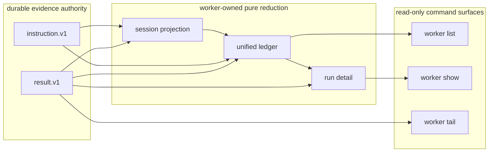
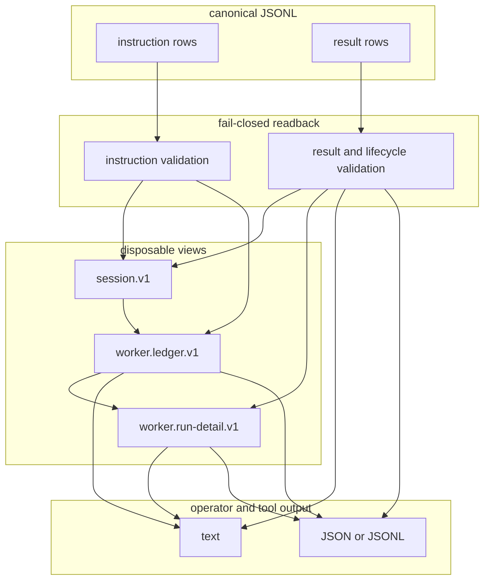

# Worker observation boundary

## One-line decision

`instruction.v1` and `result.v1` are durable evidence; `session.v1`, `worker.ledger.v1`, and `worker.run-detail.v1` are rebuildable read models only.

## Purpose lineage

| generation | purpose | contribution | relation |
|---:|---|---|---|
| G0 scope | List, inspect, and follow worker runs from one command surface. | Adds `list`, `show`, and `tail` over canonical durable rows. | direct |
| G1 correctness | Never invent a healthy run from missing or invalid evidence. | Validation and lifecycle diagnostics remain non-green and machine-readable. | direct |
| G2 boundary | Keep observation separate from execution and authority. | Observation cannot dispatch, approve, mutate, retry, redact, or append lifecycle rows. | direct |
| G3 product | Remove target-specific session hunting and terminal scrollback dependence. | Shell, Herdr, Codex, and Claude share one ledger and detail shape. | direct |
| G4 system | Rebuild read state after restart. | Every view is reduced from durable instruction/result JSONL. | direct |
| G5 organization | Give operators and agents one reviewable run surface. | Handoff no longer depends on knowing each target UI. | direct |
| G6 scale | Supervise parallel replaceable agents at low marginal cost. | New adapters reuse the same read path when they emit canonical results. | direct |
| G7 transfer | Let a new operator reconstruct run history without the original author. | Commands, docs, fixtures, and stable JSON outputs expose the evidence chain. | indirect |
| G8 due diligence | Make execution claims reproducible by a buyer. | Mixed-target, restart, malformed-row, missing-run, append-only, and terminal-tail cases are tested. | indirect |
| G9 asset value | Keep the runtime small and extensible without another database or UI authority. | Durable JSONL remains the only evidence source. | indirect |
| G10 meta | Increase company value and saleability. | Lower supervision, handoff, secret-exposure, and hidden-state risk improves transferability. | indirect |

## Architecture

## Data flow

## Command contract

| command | source | output | terminal behavior |
|---|---|---|---|
| `hq-worker list` | canonical instruction and result paths | recent mixed-target ledger, newest first | empty evidence prints `no runs` in text mode and zero JSON rows in JSON mode |
| `hq-worker show --run <id>` | canonical instruction and result paths | structural request summary, status, events, final answer/path, error, native session hint | missing run returns `worker.error.v1` with `run_not_found` |
| `hq-worker tail --run <id>` | canonical result path | current and newly appended result rows | exits after completed, failed, blocked, timeout, or cancelled; fails if emitted evidence later shrinks or changes |

The default paths follow the project-local `.hq/` layout. Explicit `--input` and `--events` paths remain available so an endpoint or deployment layer can bind local or remote-mounted evidence without changing observation meaning.

Default instruction readback includes only structural fields: id, target, op, cwd, created time, and `reply_to`. Arbitrary payload, reason, and label text is not emitted. K does not create a second redaction policy; #101 owns redaction before result text becomes durable and observable.

## Ownership

| owner | owns | must not own |
|---|---|---|
| canonical instruction/result JSONL | durable request and execution evidence | view formatting |
| worker projection | validation and deterministic reduction | target UI behavior |
| list/show/tail | read-only formatting and bounded follow | dispatch, policy, approval, redaction, claim, retry, admission |
| adapter | native session reference and transient target output | ledger fields, run identity, lifecycle authority |
| #101 safety path | redaction before durable policy/result append | observation formatting |
| envs / endpoint binding | artifact placement and process activation | hq evidence meaning |

## Invariants

1. No list/show/tail command appends or changes durable rows.
2. A ledger row requires linked valid instruction evidence and valid result lifecycle evidence.
3. Stored `session.v1` can be deleted and rebuilt without information loss.
4. List order uses `last_event_at`, not target-specific discovery order.
5. Tail performs bounded full rescans, so a lost filesystem notification cannot permanently hide an event.
6. Tail emits canonical `result.v1` rows and exits on the durable terminal event.
7. Rows already emitted by tail must not shrink or change; either case is typed non-green failure.
8. Invalid evidence is reported as non-green diagnostics; it is never converted into a completed view.
9. Default instruction readback never emits arbitrary payload, reason, or label text.
10. Native session references are hints only and never become authority.
11. No command performs live target discovery for basic history.
12. The observation layer is local/remote-placement neutral; endpoint configuration belongs outside the read model.

## Dependencies and handoff

- M lane (#100-#102) must connect actual canonical input, mandatory safety, and single-writer ownership.
- G/H/I/J (#52-#66) must emit only canonical `result.v1` through the common adapter mapper.
- #98 owns managed worker lifecycle, claim/lease, health, and crash recovery; observation only reads the resulting evidence.
- ADRS #203 keeps Herdr as host UX, Vim as client, and endpoint placement outside run authority.
- L lane (#79-#84) must execute binary-level readback and prove final answers remain available without terminal scrollback.

## Destructive cases

The observation lane is not complete if any of these succeeds:

1. list/show/tail dispatches an adapter;
2. a view is persisted as a competing event authority;
3. invalid lifecycle rows appear as healthy sessions;
4. a missing instruction is filled with target-specific defaults;
5. list requires Herdr, Codex, Claude, or shell live discovery;
6. show returns only terminal scrollback and cannot reconstruct final/error data;
7. default show/list exposes arbitrary instruction payload, reason, or labels;
8. tail drops the terminal row;
9. a lost notification permanently hides a durable row;
10. tail silently accepts deletion or rewrite of rows it already emitted;
11. missing run ids return untyped success;
12. native session ids change canonical run identity;
13. observation writes approval, retry, redaction, or claim evidence;
14. endpoint location changes the meaning of the read model.
