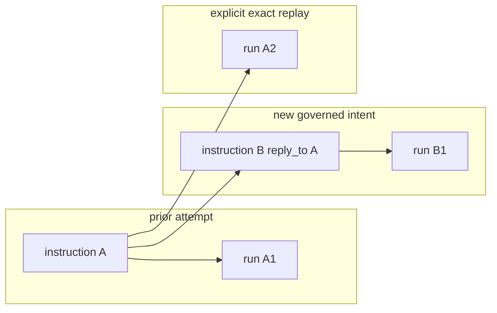

# Worker retry, replay, resume, and reconciliation

## Decision

Recovery words have separate meanings and separate identities.

| operation | instruction identity | run identity | allowed purpose | automatic? |
|---|---|---|---|---:|
| resume | same instruction | same run | continue a safely recoverable run before an ambiguous external effect | only when durable evidence proves safety |
| retry | new instruction with `reply_to` | new run | make a new governed attempt after a failed, blocked, timeout, or cancelled run | no by default |
| replay | same immutable instruction evidence | new run | explicit diagnostic reproduction of the exact prior request | never implicit product recovery |
| reconciliation | same prior evidence plus a typed operator/provider decision | no new execution until resolved | close an ambiguous post-effect crash window | no |

A terminal run never rewinds to queued or running.

## Purpose lineage

| generation | purpose | contribution | relation |
|---:|---|---|---|
| G0 scope | Define safe recovery before implementing retry commands. | Separates resume, retry, replay, and reconciliation. | direct |
| G1 correctness | Prevent duplicate side effects and false completed results. | Ambiguous provider-effect crashes fail closed. | direct |
| G2 contract | Keep lineage compatible with canonical instruction/result/session models. | New attempts remain separate instructions/runs and use `reply_to`. | direct |
| G3 product | Give operators predictable failure recovery. | Every action states whether identity, policy, and provider invocation change. | direct |
| G4 system | Align manual recovery with managed worker lifecycle. | #98 claim/lease and crash states constrain all recovery. | direct |
| G5 organization | Remove ad-hoc copying of failed JSONL rows. | Recovery becomes reviewable and machine-checkable. | direct |
| G6 scale | Let multiple adapters share one safe recovery model. | Provider-specific idempotency is an explicit capability, not a hidden exception. | direct |
| G7 transfer | Make failure handling operable by a new owner. | Decision table and examples replace tribal knowledge. | indirect |
| G8 due diligence | Avoid unverifiable exactly-once claims. | Guarantees and ambiguity windows are explicit. | indirect |
| G9 asset value | Reduce incident and support cost without adding a scheduler/database. | Existing append-only evidence remains sufficient. | indirect |
| G10 meta | Increase company value and saleability. | Lower operational ambiguity and buyer risk improve transferability. | indirect |

## State rules

### Resume

Resume preserves the same instruction and run only when canonical evidence proves that continuing cannot duplicate an external effect.

Allowed examples:

- accepted/queued evidence exists and no invocation-start evidence exists;
- a provider contract supplies a verified idempotency token covering the invocation ambiguity window;
- an adapter-specific continuation token proves the prior effect is resumable rather than repeatable.

Forbidden examples:

- a started/invoked run may have caused an external effect and no provider deduplication contract exists;
- a terminal result already exists;
- claim evidence is stale or conflicting and the effect boundary is unknown.

### Retry

Retry is a new governed intent.

Required properties:

1. create a new `instruction.v1` id;
2. set `reply_to` to the prior instruction id;
3. create a new run id when accepted by the worker;
4. validate the complete new instruction;
5. evaluate policy and approval against the new exact instruction digest;
6. never copy a prior approval, claim, terminal status, or native session id as authority;
7. keep prior instruction/result rows unchanged;
8. expose both attempts independently in the ledger.

A retry may preserve the same payload or change it. Either way it is a new instruction and must be reviewed as such.

### Replay

Replay is an explicit diagnostic action over exact immutable instruction evidence.

It creates a new run while retaining the same instruction id so a reviewer can compare execution behavior without pretending a new intent was authored. Replay is permitted only when one of these is true:

- the operation is mechanically proven side-effect-free;
- the provider accepts a verified idempotency key for the replay run;
- a human explicitly approves the replay after the same risk checks used for a new dispatch.

Replay must not be used by the managed worker as silent crash recovery. It must not bypass validation, policy, redaction, claim ownership, adapter registry, or result mapping.

### Reconciliation

When a worker crashes after the provider may have produced an external effect but before terminal `result.v1` is durable, the state is ambiguous.

Required behavior:

```text
possible provider effect
  + no durable terminal result
  + no verified idempotency/deduplication proof
  -> reconcile_required
  -> zero automatic dispatch
```

Reconciliation records a typed non-green decision such as:

- provider confirms no effect occurred, after which safe resume or retry may be selected;
- provider confirms the effect occurred, after which the missing canonical result can be repaired through an explicit evidence procedure owned by #98/L, not fabricated by observation;
- provider state remains unknown, so the run stays blocked and requires human resolution.

This document does not define a new durable row version. #98 and the canonical result/status contract must select the exact typed representation before recovery implementation merges.

## Retryability matrix

| prior state | default recovery | extra requirement |
|---|---|---|
| validation rejected | author a corrected new instruction | none beyond normal validation |
| blocked before dispatch | new retry instruction | new policy/approval evaluation |
| queued with no invocation evidence | resume same run | valid claim recovery |
| running before provider effect is proven | resume only if adapter contract proves continuation safety | adapter continuation proof |
| failed | new retry instruction | policy evaluation; provider idempotency if failure point is ambiguous |
| timeout | new retry instruction by default | prove prior provider execution is no longer active |
| cancelled before start | new retry instruction | normal policy evaluation |
| cancelled after invocation may have begun | reconciliation first | provider state or idempotency proof |
| completed | no retry by recovery logic | explicit new intent or diagnostic replay only |
| reconcile_required | no execution | explicit provider/human reconciliation |

`error.retryable=true` is advisory evidence, not dispatch permission. It cannot override lifecycle, approval, claim, or provider idempotency rules.

## Lineage and ledger behavior



The ledger lists `run A1`, `run B1`, and `run A2` as separate rows. It never collapses attempts into one status. A higher-level lineage view may group by `reply_to`, but grouping is a disposable projection and cannot overwrite run history.

## Destructive operations

Destructive or externally mutating operations require all of the following for retry or replay:

1. exact current instruction validation;
2. exact digest-bound approval when policy requires it;
3. fresh single-writer claim;
4. no unresolved prior provider effect;
5. verified provider idempotency/deduplication when automatic re-execution could cross an ambiguity window;
6. redaction before durable policy/result append;
7. new run identity and complete result evidence.

Missing any item fails closed with zero adapter calls.

## Compatibility with current implementation

- Existing normal recovery of an accepted/queued run is resume.
- Existing explicit `--replay` is diagnostic replay and must remain opt-in.
- Future user-facing retry creates a new instruction id and `reply_to` lineage.
- `session.v1` remains one row per run and never rewinds a terminal run.
- list/show/tail only observe these attempts; they do not select or execute recovery.
- #98 owns managed lifecycle, claim/lease, health, and ambiguous-crash handling.
- #101 owns mandatory policy/redaction composition before every dispatch and durable append.
- #102 owns project-local single-writer claim safety.

## Implementation gate for a future retry command

Do not implement retry until tests prove:

1. a retry always creates a new instruction id and new run id;
2. `reply_to` points to the exact prior instruction;
3. prior terminal rows remain byte-for-byte unchanged;
4. approval is rebound to the new instruction digest;
5. stale approval causes zero adapter calls;
6. replay is explicit and cannot be reached by ordinary recovery;
7. ambiguous post-effect crashes become non-green reconciliation, not automatic replay;
8. provider idempotency claims are adapter capability evidence, not booleans supplied by input;
9. ledger/readback shows every attempt independently;
10. Linux and Windows proofs use actual built binaries and canonical rows.
